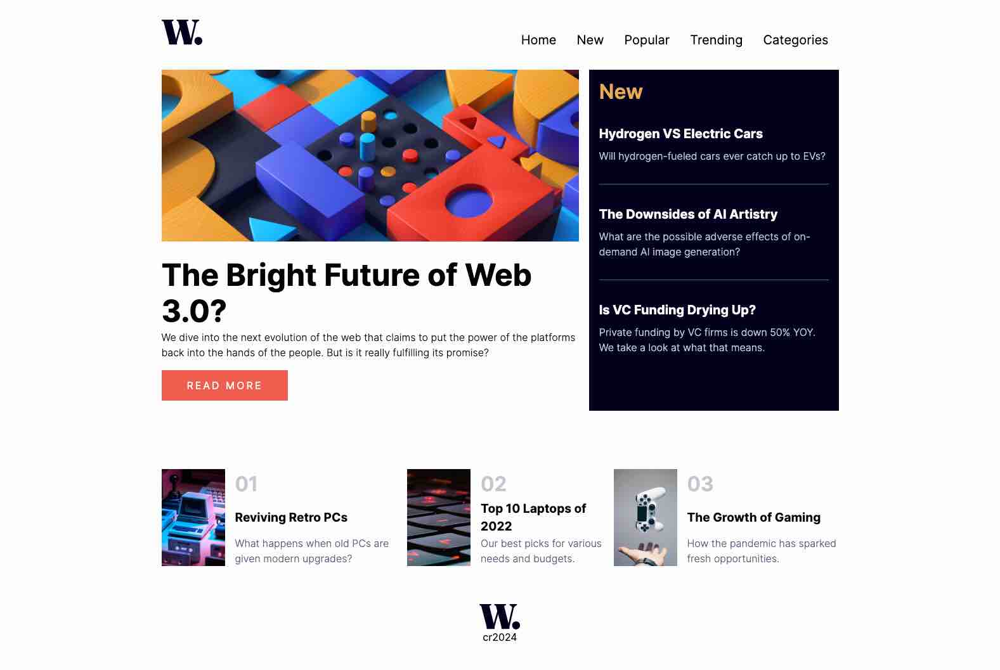
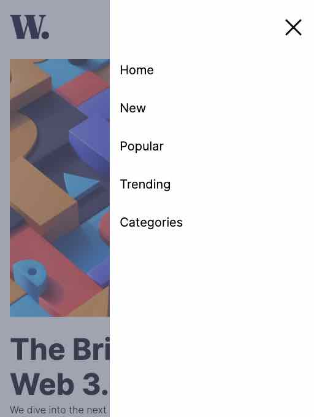

# Frontend Mentor - News homepage solution

This is a solution to the [News homepage challenge on Frontend Mentor](https://www.frontendmentor.io/challenges/news-homepage-H6SWTa1MFl). Frontend Mentor challenges help you improve your coding skills by building realistic projects.

### Built with

- Semantic HTML5 markup
- CSS custom properties and CSS mobile menu
- Flexbox
- CSS Grid
- SCSS
- Mobile-first workflow
- JS to stop scrolling in menu

### Screenshot

